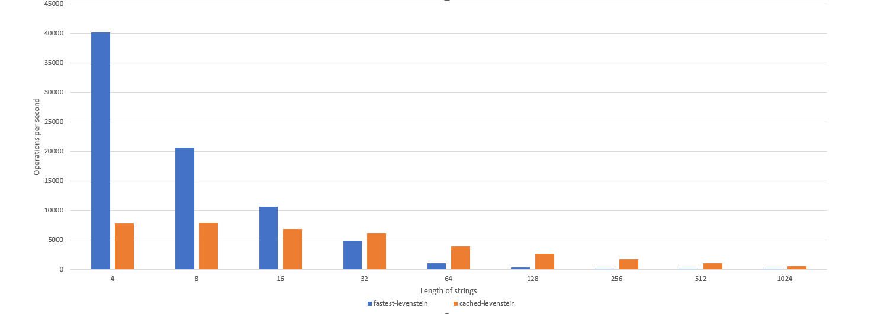

# cached-levenshtein

cached-levenshtein is a package that provides a **sometimes** faster implementation of the Levenshtein distance algorithm by using caching. It is based on [fastest-levenshtein](https://www.npmjs.com/package/fastest-levenshtein?activeTab=readme), which is known for its impressive performance. If you need to find distances for a LOT of **often repeated** strings - this is your choice.

## Installation

You can install cached-levenshtein via npm:

```
npm install cached-levenshtein
```

## Usage

To use cached-levenshtein, you can simply import it and use the `distance` method:

```javascript
const { distance } = require('cached-levenshtein');

const str1 = 'hello';
const str2 = 'world';

const result = distance(str1, str2);
console.log(result); // Output: 4
```

## Caching

This implementation of the Levenshtein distance algorithm uses caching to improve performance. If you have a lot of long strings to compare, this package can be more than 80 times faster than a regular Levenshtein distance implementation.

However, caching has an overhead, so if you know that your strings will always be different, using caching may be redundant.

## Performance

The performance of cached-levenshtein is impressive, especially when compared to a regular Levenshtein distance implementation. Below is a chart that shows the performance difference between cached-levenshtein and a regular implementation for 1000 RANDOM strings. The more exact strings dataset contains, the better performance cached-based implementation will give.


<br>
| string length | fastest-levenstein (op/sec) | cached-levenstein (op/sec) |
| :----------- | :-------------------------- | :-------------------------- |
| 4 | 40,121 | 7,856 |
| 8 | 20,671 | 7,927 |
| 16 | 10,605 | 6,862 |
| 32 | 4,872 | 6,142 |
| 64 | 1,008 | 3,983 |
| 128 | 328 | 2,636 |
| 256 | 98 | 1,762 |
| 512 | 22 | 993 |
| 1024 | 6 | 538 |
## Acknowledgements

This package is based on [fastest-levenshtein](https://www.npmjs.com/package/fastest-levenshtein?activeTab=readme), which provides a fast implementation of the Levenshtein distance algorithm.